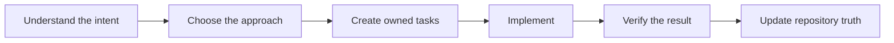

# Lean-SDLC for Codex

Lean-SDLC helps Codex build projects of any size through a controlled and understandable process. It turns user intent into clear tasks, uses safe parallel work when useful, verifies every result, and grows documentation with the project.

Lean-SDLC `v1.27.0` uses Assisted lead-coding by default. Delegating preserves the former Assisted Engineer route. Solo is lead-only.

The final V5 matched benchmark was not run. No benchmark-based performance gain is claimed.
Older benchmark results are historical context only.

It keeps four things connected:

- Why the change matters.
- What result the user expects.
- How the work will be done.
- What evidence proves the result.

These controls are intended to reduce accidental scope growth, forgotten decisions, oversized tasks, repeated work, and unsupported completion claims.

## How it works

Lean-SDLC follows one practical flow:



The workflow starts by restating the user's intent in clear language.

The Architect then chooses the technical direction. It explains important decisions before implementation starts.

The plan divides the work into independently testable tasks. Each task has an owner, acceptance criteria, and proof.

Implementation starts only after the plan is ready. Completion requires evidence that matches the requested result.

If the request is already clear, these steps can be very short.

## The Architect and child agents

The Architect is a workflow role independent of the selected model.

The Architect is the Lead for the Assisted lead-coding path.

The Architect owns:

- User and business intent.
- Product behavior.
- Architecture and interfaces.
- Task boundaries and ledger mutations.
- Acceptance criteria.
- Integration and final approval.

Each work item remains Routine or Critical with a short reason. The workflow defines four agent roles:

| Role | Work |
| --- | --- |
| Engineer | Implements one approved task in Delegating mode, completes permitted corrections, and runs focused checks. |
| Scout | Performs substantial discovery across code, documentation, logs, or external sources. |
| Maintainer | Optionally updates records and documents, or checks known information and established procedures. |
| Verifier | Independently reviews Critical acceptance and important regression risks. |

The Architect gives each child a clear boundary. The child does not redesign the product or widen the task.

Routine support progress stays quiet in its child thread in Assisted and Delegating. Parent messages are only for events that require immediate Architect action. Completion produces one final return. The Architect does not repeat unchanged child facts.

Clear contracts state the outcome, interfaces, invariants, failure behavior, mandatory decisions, suggestions, freedom, proof, and stop conditions.

The Architect reviews actual changes, evidence, and changed public interfaces against consumers, tests, and documented usage. It chooses Accept, Revise, or Redesign and returns actionable findings together.

Revise keeps the same team when the contract remains settled. Redesign corrects the contract before work resumes.

For small settled tasks, use the selected workflow without compulsory child handoffs. Larger or uncertain tasks use specific decision or risk checkpoints. Material blockers and conflicts escalate.

## Assisted, Delegating, and Solo modes

Assisted mode is the default. Its Lead path keeps production code, core tests, decisions, acceptance, and task mutations with the Lead.

The Lead can use optional support with a concise contract stating the reason, owned boundary, acceptance, proof, and stop condition. Maintainer handles records, documentation, known information, or established checks. Scout handles substantial discovery.

Before an expensive or state-changing operation, confirm the exact target, prerequisites, and required permissions through read-only checks.

Delegating mode preserves the previous Assisted Engineer workflow. It keeps the existing child handoffs, proof, and correction rules.

Solo mode is lead-only and starts no automatic child. A tiny chore does not require a child when handoff overhead exceeds its benefit.

Routine and Critical still control proof. Critical work requires independent review and evidence, including for Lead-written work. In Solo, missing evidence requires an approved reviewer or a mode change; Solo does not spawn a Verifier automatically.

All modes use the same planning, task ownership, and verification rules. No mode silently lowers the selected model or effort.

Saved mode state is versioned. New state starts in `assisted`. Only the exact unversioned legacy state `{mode, fast_children}` migrates: legacy `assisted` becomes `delegating` with active mode locked, and legacy `solo` stays `solo`. Invalid or unknown state is reported and never reset to defaults.

The selected mode is the requested or restored choice. The active mode is the mode locked for this session. A default `Mode: assisted` does not mean Assisted is active.

The contract upgrader recognizes the exact released `v1.26.0` template. It replaces only the managed prefix and preserves appended custom project rules. Edited or unknown core instructions require explicit manual reconciliation. Do not overwrite custom rules or interpret application changes as migration authority. After an authorized upgrade, start a fresh session so stale injected instructions are not reused.

Restored context reads state but does not begin a fresh mode. For authorized implementation, select and explicitly begin the mode before loading shared and selected workflow instructions. A same-mode begin reuses instructions already loaded. Discussion remains read-only and does not activate a mode. The spawn guard rejects an unbegun mode. An active mode change requires a fresh session and instruction reload.

Hooks validate covered spawn arguments only. They do not establish identity or prevent canceled child writes.

The latest user outcome, scope, proof, and stop condition govern execution and resume. A canceled support path cannot restart from late results. A status question does not cancel work. An explicit stop ends nonessential work.

An interrupted child turn can leave its command running. No atomic guarantee exists for command termination during interruption. Cancel and verify the command before interrupting the child.

Delivery, verified acceptance, and marking all earlier tasks `Done` are separate outcomes. A truthful handoff uses current evidence and does not wait for obsolete paperwork.

During planning, Lean-SDLC checks whether each result is independently acceptable. It uses native runtime capacity and independent mutable ownership to decide useful concurrency.

Independent work can run together when mutable ownership is separate, native capacity permits it, and the expected benefit exceeds handoff and verification costs. Shared resources stay serial. There is no fixed workflow-agent or Engineer-count limit.

External-tool call count and discovery are cues only. Preserve permissions and one mutable-target owner.

## Tasks and repository memory

Lean-SDLC keeps work in a human-readable `tasks.csv` file at the repository root.

The existing tasks helper remains the sole ledger writer. The Lead owns task mutations. Support roles retrieve concise task views and current documents.

Each implementation task represents one complete outcome with cohesive tests and documentation. Split only at independent acceptance boundaries, not arbitrary files, functions, or lines. Accept foundation work before dependent work and assign a combined integration check.

The current task list also appears in the Codex plan view.

Three files form the minimum repository contract:

- `AGENTS.md` contains durable repository instructions.
- `docs/PROJECT.md` explains the project purpose, scope, and success criteria.
- `tasks.csv` contains planned and active work.

Other documents remain optional. Lean-SDLC creates them only when the project needs durable shared information.

This repository state helps Codex continue correctly after a restart or context compaction.

## Small changes

Small and settled Routine changes can use a Quick Fix with an owner and focused check.

Critical acceptance requires independent verification, including Lead-written work.

A Quick Fix avoids unnecessary child agents and broad verification. Related Quick Fixes can receive one shared review later.

## Verification

Lean-SDLC separates three types of evidence:

- Focused checks cover the changed behavior.
- Acceptance checks prove the requested result.
- Regression checks cover important nearby risks.

Define observable acceptance before implementation. For testable behavior, prepare or identify the acceptance check before changing production code.

Run documentation commands exactly as a user would in the documented environment. If a command fails, fix the document or verify its prerequisite. Do not create an undocumented alias or environment workaround.

Evaluation evidence has a separate boundary:

- Helper tests check evaluation code behavior. Document tests check required contract wording.
- `tests/evaluation_runner.py` grades saved JSON answers against scenario assertions. With default arguments, it reads `tests/evaluation_observations_fixture.json`. It does not execute an agent or verify agent actions.
- Optional `tests/live_evaluation.py` runs fresh Codex sessions, collects final structured JSON answers, and validates their structure. Pass its output to `tests/evaluation_runner.py` for separate grading. It does not grade decision correctness or verify tool actions, file edits, or real workflow reliability.

Neither evaluation path measures real workflow execution reliability.

The workflow avoids repeating identical checks without a reason.

One command may satisfy several proof purposes. Reuse proof or artifacts only when source, dependencies, configuration, environment, toolchain, and target inputs remain valid. Stop dependent actions when metadata validation fails.

Shared documentation and common regression checks can run as one batch across atomic tasks. Each task keeps its own acceptance set and cannot close before its acceptance passes. Final release checks stop relevant writers first.

Large test suites run only when the change or repository risk justifies them.

A task closes only after the evidence matches its acceptance criteria.

## Repeated operations

Builds, deployments, firmware flashing, packaging, and similar operations can become recorded procedures. Keep executable commands in code blocks, separate from explanatory prose.

If a repeated procedure becomes stable, Lean-SDLC can propose a deterministic script. It does not create permanent automation without a useful reuse case.

Recorded procedures remain visible and maintainable inside the repository.

## Install

Requirements:

- Git
- Python 3
- Codex with plugin support

Install the immutable `v1.27.0` release:

```bash
git clone --depth 1 --branch v1.27.0 https://github.com/laikrodiz/lean-sdlc.git
cd lean-sdlc
codex plugin marketplace add .
codex plugin add lean-sdlc@lean-sdlc
```

Restart Codex after installation. Then start a new thread.

Lean-SDLC checks for a newer release once daily. It never updates itself automatically.

## Use

Initialize a repository:

```text
Use $lean-sdlc to initialize this repository and shape the project.
```

Continue existing work:

```text
Use $lean-sdlc to continue this repository task.
```

Select a workflow only when needed:

```text
Use $lean-sdlc in Assisted, Delegating, or Solo mode.
```

Upgrade an older Lean-SDLC repository:

```text
Use $lean-sdlc to upgrade this repository to the current contract.
```

## Detailed rules

The README explains the product. The following documents define the exact behavior:

- [Shape](plugins/lean-sdlc/skills/lean-sdlc/references/shape.md)
- [Plan](plugins/lean-sdlc/skills/lean-sdlc/references/plan.md)
- [Repository contract](plugins/lean-sdlc/skills/lean-sdlc/references/repository-contracts.md)
- [Assisted mode](plugins/lean-sdlc/skills/lean-sdlc/references/assisted.md)
- [Delegating mode](plugins/lean-sdlc/skills/lean-sdlc/references/delegating.md)
- [Solo mode](plugins/lean-sdlc/skills/lean-sdlc/references/solo.md)
- [Verification](plugins/lean-sdlc/skills/lean-sdlc/references/verify.md)
- [Operations](docs/OPERATIONS.md)
