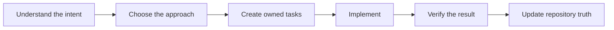

# Lean-SDLC for Codex

Lean-SDLC helps Codex build projects of any size through a controlled and understandable process. It turns user intent into clear tasks, uses safe parallel work when useful, verifies every result, and grows documentation with the project.

It keeps four things connected:

- Why the change matters.
- What result the user expects.
- How the work will be done.
- What evidence proves the result.

These controls are intended to reduce accidental scope growth, forgotten decisions, oversized tasks, repeated work, and unsupported completion claims.

## How it works

Lean-SDLC follows one practical flow:



The workflow starts by restating the user's intent in clear language.

The Architect then chooses the technical direction. It explains important decisions before implementation starts.

The plan divides the work into independently testable tasks. Each task has an owner, acceptance criteria, and proof.

Implementation starts only after the plan is ready. Completion requires evidence that matches the requested result.

If the request is already clear, these steps can be very short.

## The Architect and child agents

The Architect is a workflow role independent of the selected model.

The Architect owns:

- User and business intent.
- Product behavior.
- Architecture and interfaces.
- Task boundaries.
- Acceptance criteria.
- Integration and final approval.

In Assisted mode, each work item is Routine or Critical with a short reason. The Architect delegates suitable work to four child roles:

| Role | Work |
| --- | --- |
| Engineer | Implements one approved task, completes permitted corrections, and runs its focused checks. |
| Scout | Searches code, documentation, logs, or external sources for a defined question. |
| Maintainer | Updates shared documentation and runs recorded project operations. |
| Verifier | Independently checks acceptance and important regression risks. |

The Architect gives each child a clear boundary. The child does not redesign the product or widen the task.

Clear contracts state the outcome, interfaces, invariants, failure behavior, mandatory decisions, suggestions, freedom, proof, and stop conditions.

The Architect reviews actual changes and evidence. It chooses Accept, Revise, or Redesign and returns actionable findings together.

Revise keeps the same team when the contract remains settled. Redesign corrects the contract before work resumes.

For small settled tasks, routine progress stays in child threads. Larger or uncertain tasks use specific decision or risk checkpoints. Material blockers and conflicts escalate.

## Assisted and Solo modes

Assisted mode is the default. It uses child agents when the expected benefit exceeds handoff and verification costs.

In Assisted mode, the Architect normally handles eligible Routine Quick Fixes. Luna Max handles routine non-Quick-Fix work and may handle Critical work under a precise design. A rare bounded Critical implementation may stay with the Architect when design and implementation coupling creates substantial misunderstanding or repeated redesign risk. Independent review remains mandatory.

Solo mode keeps all work with the Architect. Critical work cannot self-certify without independent evidence. Surface a conflict when that evidence is missing, then use an approved reviewer or change mode.

Both modes use the same planning, task ownership, and verification rules. Neither mode silently lowers the selected model or effort.

During planning, Lean-SDLC checks whether each result is independently acceptable. It uses native runtime capacity and independent mutable ownership to decide useful concurrency.

Independent work can run together when mutable ownership is separate, native capacity permits it, and the expected benefit exceeds handoff and verification costs. Shared resources stay serial. There is no fixed workflow-agent or Engineer-count limit.

External-tool call count and discovery are cues only. Preserve permissions and one mutable-target owner.

## Tasks and repository memory

Lean-SDLC keeps work in a human-readable `tasks.csv` file at the repository root.

Each implementation task represents one complete outcome with cohesive tests and documentation. Split only at independent acceptance boundaries, not arbitrary files, functions, or lines. Accept foundation work before dependent work and assign a combined integration check.

The current task list also appears in the Codex plan view.

Three files form the minimum repository contract:

- `AGENTS.md` contains durable repository instructions.
- `docs/PROJECT.md` explains the project purpose, scope, and success criteria.
- `tasks.csv` contains planned and active work.

Other documents remain optional. Lean-SDLC creates them only when the project needs durable shared information.

This repository state helps Codex continue correctly after a restart or context compaction.

## Small changes

Small and settled Routine changes can use a Quick Fix with an owner and focused check.

Critical acceptance requires independent verification, including Architect-written work.

A Quick Fix avoids unnecessary child agents and broad verification. Related Quick Fixes can receive one shared review later.

## Verification

Lean-SDLC separates three types of evidence:

- Focused checks cover the changed behavior.
- Acceptance checks prove the requested result.
- Regression checks cover important nearby risks.

Evaluation evidence has a separate boundary:

- Helper tests check evaluation code behavior. Document tests check required contract wording.
- `tests/evaluation_runner.py` grades saved JSON answers against scenario assertions. With default arguments, it reads `tests/evaluation_observations_fixture.json`. It does not execute an agent or verify agent actions.
- Optional `tests/live_evaluation.py` runs fresh Codex sessions, collects final structured JSON answers, and validates their structure. Pass its output to `tests/evaluation_runner.py` for separate grading. It does not grade decision correctness or verify tool actions, file edits, or real workflow reliability.

Neither evaluation path measures real workflow execution reliability.

The workflow avoids repeating identical checks without a reason.

One command may satisfy several proof purposes. Reuse proof or artifacts only when source, dependencies, configuration, environment, toolchain, and target inputs match.

Shared documentation and common regression checks can run as one batch across atomic tasks. Each task keeps its own acceptance set and cannot close before its acceptance passes. Final release checks stop relevant writers first.

Large test suites run only when the change or repository risk justifies them.

A task closes only after the evidence matches its acceptance criteria.

## Repeated operations

Builds, deployments, firmware flashing, packaging, and similar operations can become recorded procedures.

If a repeated procedure becomes stable, Lean-SDLC can propose a deterministic script. It does not create permanent automation without a useful reuse case.

Recorded procedures remain visible and maintainable inside the repository.

## Install

Requirements:

- Git
- Python 3
- Codex with plugin support

Install the immutable `v1.26.0` release:

```bash
git clone --depth 1 --branch v1.26.0 https://github.com/laikrodiz/lean-sdlc.git
cd lean-sdlc
codex plugin marketplace add .
codex plugin add lean-sdlc@lean-sdlc
```

Restart Codex after installation. Then start a new thread.

Lean-SDLC checks for a newer release once daily. It never updates itself automatically.

## Use

Initialize a repository:

```text
Use $lean-sdlc to initialize this repository and shape the project.
```

Continue existing work:

```text
Use $lean-sdlc to continue this repository task.
```

Use only the Architect:

```text
Use $lean-sdlc in Solo mode.
```

Upgrade an older Lean-SDLC repository:

```text
Use $lean-sdlc to upgrade this repository to the current contract.
```

## Detailed rules

The README explains the product. The following documents define the exact behavior:

- [Shape](plugins/lean-sdlc/skills/lean-sdlc/references/shape.md)
- [Plan](plugins/lean-sdlc/skills/lean-sdlc/references/plan.md)
- [Repository contract](plugins/lean-sdlc/skills/lean-sdlc/references/repository-contracts.md)
- [Child-agent policy](plugins/lean-sdlc/skills/lean-sdlc/references/subagents.md)
- [Verification](plugins/lean-sdlc/skills/lean-sdlc/references/verify.md)
- [Operations](docs/OPERATIONS.md)
