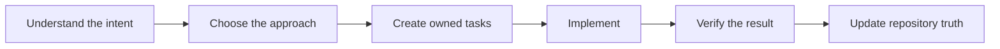

# Lean-SDLC for Codex

Lean-SDLC helps Codex build projects of any size through a controlled and understandable process. It turns user intent into clear tasks, uses safe parallel work when useful, verifies every result, and grows documentation with the project.

It keeps four things connected:

- Why the change matters.
- What result the user expects.
- How the work will be done.
- What evidence proves the result.

This reduces accidental scope growth, forgotten decisions, oversized tasks, repeated work, and unsupported completion claims.

## How it works

Lean-SDLC follows one practical flow:



The workflow starts by restating the user's intent in clear language.

The Architect then chooses the technical direction. It explains important decisions before implementation starts.

The plan divides the work into independently testable tasks. Each task has an owner, acceptance criteria, and proof.

Implementation starts only after the plan is ready. Completion requires evidence that matches the requested result.

If the request is already clear, these steps can be very short.

## The Architect and child agents

Your selected Codex model remains the Architect. Lean-SDLC does not replace it with another model.

The Architect owns:

- User and business intent.
- Product behavior.
- Architecture and interfaces.
- Task boundaries.
- Acceptance criteria.
- Integration and final approval.

In Assisted mode, the Architect delegates suitable work to four child roles:

| Role | Work |
| --- | --- |
| Engineer | Implements one approved task and runs its focused checks. |
| Scout | Searches code, documentation, logs, or external sources for a defined question. |
| Maintainer | Updates shared documentation and runs recorded project operations. |
| Verifier | Independently checks acceptance and important regression risks. |

The Architect gives each child a clear boundary. The child does not redesign the product or widen the task.

The Architect reviews the returned work and remains responsible for the result.

## Assisted and Solo modes

Assisted mode is the default. It uses child agents when delegation should save time or Architect context.

Solo mode keeps all work with the Architect. You can request Solo mode at any time.

Both modes use the same planning, task ownership, and verification rules.

During planning, Lean-SDLC checks whether broad work can become independent tasks. It runs them together only when separation is safe and saves meaningful time.

Parallel work is allowed only when the scopes are clearly separate. Shared files, changing interfaces, and external targets stay serial.

## Tasks and repository memory

Lean-SDLC keeps work in a human-readable `tasks.csv` file at the repository root.

Each implementation task represents one independently accepted result. Large requests become several tasks when their parts need separate implementation or verification.

The current task list also appears in the Codex plan view.

Three files form the minimum repository contract:

- `AGENTS.md` contains durable repository instructions.
- `docs/PROJECT.md` explains the project purpose, scope, and success criteria.
- `tasks.csv` contains planned and active work.

Other documents remain optional. Lean-SDLC creates them only when the project needs durable shared information.

This repository state helps Codex continue correctly after a restart or context compaction.

## Small changes

Small and settled changes can use a Quick Fix with an owner and focused check.

It avoids unnecessary child agents and broad verification. Related Quick Fixes can receive one shared review later.

## Verification

Lean-SDLC separates three types of evidence:

- Focused checks cover the changed behavior.
- Acceptance checks prove the requested result.
- Regression checks cover important nearby risks.

The workflow avoids repeating identical checks without a reason.

Large test suites run only when the change or repository risk justifies them.

A task closes only after the evidence matches its acceptance criteria.

## Repeated operations

Builds, deployments, firmware flashing, packaging, and similar operations can become recorded procedures.

If a repeated procedure becomes stable, Lean-SDLC can propose a deterministic script. It does not create permanent automation without a useful reuse case.

Recorded procedures remain visible and maintainable inside the repository.

## Install

Requirements:

- Git
- Python 3
- Codex with plugin support

Install the immutable `v1.24.0` release:

```bash
git clone --depth 1 --branch v1.24.0 https://github.com/laikrodiz/lean-sdlc.git
cd lean-sdlc
codex plugin marketplace add .
codex plugin add lean-sdlc@lean-sdlc
```

Restart Codex after installation. Then start a new thread.

Lean-SDLC checks for a newer release once daily. It never updates itself automatically.

## Use

Initialize a repository:

```text
Use $lean-sdlc to initialize this repository and shape the project.
```

Continue existing work:

```text
Use $lean-sdlc to continue this repository task.
```

Use only the Architect:

```text
Use $lean-sdlc in Solo mode.
```

Upgrade an older Lean-SDLC repository:

```text
Use $lean-sdlc to upgrade this repository to the current contract.
```

## Detailed rules

The README explains the product. The following documents define the exact behavior:

- [Shape](plugins/lean-sdlc/skills/lean-sdlc/references/shape.md)
- [Plan](plugins/lean-sdlc/skills/lean-sdlc/references/plan.md)
- [Repository contract](plugins/lean-sdlc/skills/lean-sdlc/references/repository-contracts.md)
- [Child-agent policy](plugins/lean-sdlc/skills/lean-sdlc/references/subagents.md)
- [Verification](plugins/lean-sdlc/skills/lean-sdlc/references/verify.md)
