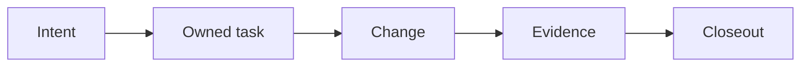

# Lean-SDLC for Codex

Lean-SDLC is a small software engineering workflow for Codex. It reduces token waste, makes the active process visible, and helps finish requested work. It keeps a repository tied to a real outcome, a named owner, and evidence that another person or agent can inspect.

The workflow helps you answer simple questions before work starts. What problem are you solving? Who benefits? What must change? What must stay unchanged? How will you know that the result is correct? It keeps these answers close to the task ledger and the repository documents that own them.

The user controls the Architect model. If the user makes no explicit choice, the Architect uses Sol High. Standard child roles use Luna Max. Terra XHigh is the availability fallback.

## Six lanes

Lean-SDLC routes a request through the first lane that still needs work.

| Lane | Purpose |
| --- | --- |
| Shape | Define the problem, affected user, scope, promise, and observable success. |
| Decide | Record technical choices that need durable agreement. |
| Plan | Turn approved intent into owned tasks and a safe execution shape. |
| Diagnose | Bound an uncertain failure before choosing a fix. |
| Deliver | Implement one approved change and synchronize affected truth. |
| Verify | Check acceptance, reconcile repository truth, and close with evidence. |

The lanes are gates. A clear request can move through them quickly. An unclear request stops at Shape until the missing outcome or boundary is understood.

## A clear path from intent to proof

Before a change, the Architect agent confirms four connected parts:

- **Why** states the user or business value.
- **What** states the smallest observable outcome, constraints, and non-goals.
- **How** states the technical approach and task shape.
- **Proof** states the acceptance conditions and verification method.

The Architect owns this contract. The Architect also owns architecture, interfaces, task boundaries, integration, acceptance, and closeout. A child agent never invents a product decision or widens its assigned work.

During implementation, unresolved ledger task IDs and titles appear in Codex's plan view. Brainstorming and rephrasing stay read-only and create no task view. This keeps the visible plan connected to the human-readable ledger while the ledger remains authoritative.



The task ledger is atomic. Each task describes one independently accepted repository state, one owner, one acceptance set, and one proof set. Dependencies must be complete before a task starts. Task commands protect the ledger during updates, so contributors do not edit `tasks.csv` by hand.

Every initialized repository has three required files:

- `AGENTS.md` stores durable repository rules.
- `docs/PROJECT.md` stores the problem, scope, outcome, and success criteria.
- `tasks.csv` stores the current human-readable task ledger.

Feature, decision, architecture, interface, and operations documents remain optional. Add them when shared pressure makes the detail worth keeping.

## Roles and operating modes

The Architect agent is the lead. Four standard subagents support the lead when their work is useful:

| Role | Responsibility |
| --- | --- |
| Engineer | Implements one approved task and reports a bounded checkpoint. |
| Maintainer | Synchronizes shared documents and replays recorded operations. |
| Verifier | Checks acceptance independently and reports evidence or risk. |
| Scout | Collects bounded, cited evidence for a defined question. |

Assisted Lean-SDLC mode is the default. It delegates suitable work through these roles and keeps the Architect responsible for decisions. Solo mode keeps execution with the Architect when the user selects it. Both modes use the same task, safety, acceptance, and proof rules. User can switch between the modes by requesting the change.

Parallel work is conservative. It is allowed only when tasks have separate scopes, settled contracts, independent proof, and no shared mutable resource. Shared files, changing interfaces, migrations, fixtures, generated output, and external targets stay serial. Integration, documentation synchronization, verification, operations, and closeout stay serial as well. If safety or time savings are unclear, the workflow chooses serial work.

Substantial external-tool work follows the same boundary. The Architect keeps the decision. Scout handles bounded discovery. Engineer handles approved mutations. Maintainer handles repeated operations. Verifier handles independent checks. One agent owns each mutable external target.

When Codex resumes or compacts a task, Lean-SDLC returns to durable repository truth. It reads the project rules, reloads unresolved ledger work, rebuilds the visible plan, and restores the task mode and owner before delivery continues. This prevents lost context from becoming an unrecorded decision.

## Evidence and detailed contracts

The Engineer checks local mechanics. The Maintainer records operation evidence. The Verifier reruns acceptance proof and one planned regression command. The Architect reviews the returned checkpoint, resolves deviations, and closes the owned task only after the evidence matches the contract.

Read the [Shape contract](plugins/lean-sdlc/skills/lean-sdlc/references/shape.md), [Plan contract](plugins/lean-sdlc/skills/lean-sdlc/references/plan.md), [repository contract](plugins/lean-sdlc/skills/lean-sdlc/references/repository-contracts.md), [canonical child-agent policy](plugins/lean-sdlc/skills/lean-sdlc/references/subagents.md), and [trigger evaluations](plugins/lean-sdlc/skills/lean-sdlc/references/trigger-evals.md) for detailed rules.

## Install

Requirements: Git, Python 3, and Codex with plugin support.

Install the immutable `v1.15.0` release:

```bash
git clone --depth 1 --branch v1.15.0 https://github.com/laikrodiz/lean-sdlc.git
cd lean-sdlc
codex plugin marketplace add .
codex plugin add lean-sdlc@lean-sdlc
```

Restart Codex after installation. Then begin a new task.

## Use

For a new repository:

```text
Use $lean-sdlc to initialize this repository and shape the project.
```

For existing work:

```text
Use $lean-sdlc to continue this repository task safely.
Use $lean-sdlc in solo mode and verify the change.
```

After upgrading an older Lean-SDLC project:

```text
Use $lean-sdlc to upgrade this repository to the current contract.
```

The migration moves `planning/tasks.csv` to root `tasks.csv` under the active task lock.
